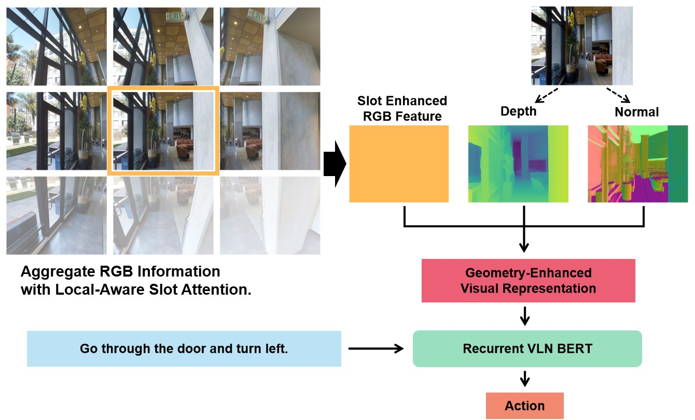

# GeoVLN

This is the official PyTorch implementation of the **CVPR 2023** paper:

[**"GeoVLN: Learning Geometry-Enhanced Visual Representation with Slot Attention for Vision-and-Language Navigation"**<br>](https://arxiv.org/abs/2305.17102)

<div style="text-align: center;">
  
</div>

## Prerequisites

### Installation

1. Install the [Matterport3D Simulator (the latest version)](https://github.com/peteanderson80/Matterport3DSimulator).


2. Install other dependencies.
```
pip install -r requirements.txt
```

### Data Preparation

Download the checkpoints, precomputed RGB, depth and normal features from [here](https://drive.google.com/drive/folders/1KYhwydwxpA3ap58E7YCh8wmJ7B4EK1ub?usp=sharing). 
Download other data following the instructions of [Recurrent-VLN-BERT](https://github.com/YicongHong/Recurrent-VLN-BERT) and [HAMT](https://github.com/cshizhe/VLN-HAMT), including the annotations, connectivity maps, and pretrained models.

### Feature Extraction (optional)

The RGB, depth and normal fearures are already included in the downloaded data. If you want to reextract them yourself, please follow the instructions below.

1. Download the RGB images from [here](https://github.com/niessner/Matterport). 
2. Estimate the depth maps and normal maps using Omnidata (https://github.com/EPFL-VILAB/omnidata/blob/main/omnidata_tools/torch/demo.py).
3. Extract RGB, depth and normal fearures.
```
cd Recurrent-VLN-BERT
python img_features/precompute_img_features.py
```

```
cd VLN-HAMT
python preprocess/precompute_features_vit.py
```

## GeoVLN with the backbone Recurrent-VLN-BERT

### Training

```
cd Recurrent-VLN-BERT
bash run/train_geo.bash
```
The trained model will be saved in ``snap``.

### Evaluation
Modify the argument ``load`` in ``run/test_geo.bash``, and then
```
bash run/test_geo.bash
```


## GeoVLN† with the backbone HAMT

### Training and Evaluation

Modify the arguments in ``run/run_r2r_geo.bash``, and then

```
cd VLN-HAMT/finetune_src
bash run/run_r2r_geo.bash
```


## Citation
If you find our work useful to your research, please consider citing: 
```
@inproceedings{huo2023geovln,
  title={GeoVLN: Learning Geometry-Enhanced Visual Representation with Slot Attention for Vision-and-Language Navigation},
  author={Huo, Jingyang and Sun, Qiang and Jiang, Boyan and Lin, Haitao and Fu, Yanwei},
  booktitle={Proceedings of the IEEE/CVF Conference on Computer Vision and Pattern Recognition},
  pages={23212--23221},
  year={2023}
}
```

## Acknowledgement
Some of the codes for this project are borrowed from the following sources:
- [Recurrent-VLN-BERT](https://github.com/YicongHong/Recurrent-VLN-BERT)
- [HAMT](https://github.com/cshizhe/VLN-HAMT)